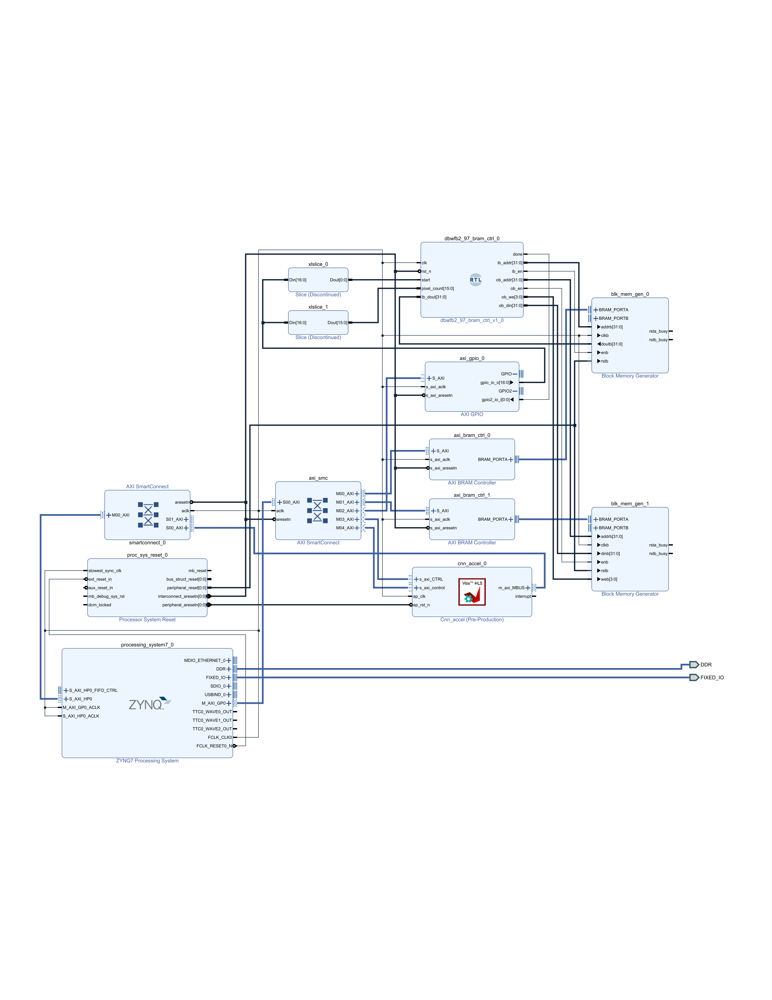

# A Zero-DSP Wavelet Preprocessing Integration for Resource-Constrained INT8 CNNs on Edge FPGAs

## Project overview

This repository provides the software, RTL, HLS CNN, firmware, reports and captured results for a multiplier-free DBWFB2-9/7 low-low (LL) front end on a Zynq-7000 ZedBoard (`xc7z020clg484-1`). It includes a compact true-INT8 CNN, a same-flow 2x2 average-pooling (AvgPool) hardware baseline, a five-seed software evaluation and a separate hardware-equivalent DBWFB2 replay. The study characterizes an integrated edge-FPGA system and does not establish universal accuracy, resource or power superiority for DBWFB2.

The Arm processor writes raw 128x128 grayscale images to input BRAM. The programmable-logic controller filters one dimension at a time, and the processor reorders/transposes the row-pass result for the column pass. The 64x64 LL output is quantized and packed in DDR for the CNN. AXI GPIO provides preprocessing start/done control, and the HLS CNN reads DDR through its AXI master interface.

## Experimental scope

The main classification experiment uses the airplane, car, dog and ship classes of STL-10.

| Partition | Images | Images per class |
|---|---:|---:|
| Training | 1,600 | 400 |
| Validation | 400 | 100 |
| Independent test | 3,200 | 800 |
| Board500 test subset | 500 | 125 |

Board500 is a fixed stratified subset of the independent test partition, not a second independent test set. The main accuracies apply to this four-class scope and do not establish general performance across broader datasets or tasks. The separate ten-class analysis is exploratory. Split and subset records are [split_manifest.json](results/split_manifest.json) and [board500_indices.csv](results/board500_indices.csv).

## Frozen software protocol

Training seeds are **42, 100, 123, 777 and 2024**. Training and validation alone determine early stopping, checkpoint selection, gain, shifts and deployment-seed selection.

| Arm | Selected seed |
|---|---:|
| Full | 777 |
| AvgPool | 42 |
| Haar | 42 |
| DBWFB2 | 42 |

DBWFB2 uses gain 1, `C1_SHIFT=9` and `C2_SHIFT=8`. AvgPool uses gain 1, `C1_SHIFT=9` and `C2_SHIFT=7`. The per-arm records are under [software/int8_packages/](software/int8_packages/).

Independent-test results are mean +/- sample standard deviation over five seeds:

| Arm | Float accuracy (%) | True-INT8 accuracy (%) | True-INT8 macro-F1 (%) |
|---|---:|---:|---:|
| Full | 78.12 +/- 0.30 | 77.79 +/- 0.80 | 77.70 +/- 0.70 |
| AvgPool | 80.30 +/- 0.22 | 79.16 +/- 0.77 | 79.13 +/- 0.76 |
| Haar | 80.30 +/- 0.22 | 79.16 +/- 0.77 | 79.13 +/- 0.76 |
| DBWFB2 | 79.16 +/- 0.83 | 78.31 +/- 0.69 | 78.34 +/- 0.66 |

The [executed notebook](notebooks/DBWFB2_STL10_REPRODUCIBILITY.ipynb) preserves the code and saved outputs. Seed-level results, aggregates and paired statistics are in [results/](results/). None of the paired DBWFB2 comparisons reaches the prespecified significance threshold, and TOST does not establish equivalence. Aligned Haar LL and non-overlapping 2x2 AvgPool produce identical main-experiment software inputs. Haar is a software control, not a separately routed hardware design.

## Software comparison versus hardware-equivalent replay

The five-seed software comparison uses trailing replicate extension with forward complete-window sampling. Hardware-equivalent DBWFB2 replay additionally reproduces centered even-phase alignment, an effective -4 input-position offset, retained cross-transaction state and deployed integer arithmetic, clipping and packing.

| Selected DBWFB2 result | Count | Accuracy/agreement |
|---|---:|---:|
| Seed-42 software accuracy | 2488/3200 | 77.75% |
| Physical FPGA accuracy | 2497/3200 | 78.03% |
| Selected software/FPGA agreement | 3006/3200 | 93.94% |
| Hardware-equivalent replay/FPGA agreement | 3200/3200 | 100% |

The selected software reference and FPGA differ on 194 predictions, with an accuracy difference of +0.28 percentage points. The replay is separate from the five-seed aggregates. **Full, Haar and AvgPool were not evaluated under the DBWFB2 hardware-equivalent stream convention.** Retained state describes this implementation, not a property of the wavelet itself.

Changing only trailing replicate extension to zero extension changes 55 predictions but leaves accuracy at 2497/3200 for both settings. Replicate extension is not claimed to improve accuracy. The 64x64 paths perform GAP over 16x16 Pool2 maps using `>>8`. The Full 128x128 software control uses 32x32 maps and `>>10`. Only the 64x64 CNN is physically deployed.

## Verified AvgPool hardware configuration

The reported AvgPool implementation uses the selected seed-42 weights, gain 1 and shifts 9/7. Its selected software test accuracy is 2558/3200 (79.9375%).

| Whole-system quantity | Value |
|---|---:|
| LUTs | 10,327 |
| FFs | 11,817 |
| Block RAM tiles | 67 |
| DSPs | 4 |
| WNS at 100 MHz | +0.776 ns |
| TNS | 0.000 ns |
| Complete dynamic estimate | 1.736 W |
| Device-static estimate | 0.154 W |
| Total on-chip estimate | 1.889 W |

Board500 completed 500/500 scheduled images with **416/500 (83.20%)** correct, **498/500 (99.60%)** selected software-reference agreement and **zero hardware errors**. Class-correct counts are 108/125 airplane, 98/125 car, 119/125 dog and 91/125 ship.

| ARM-observed timing | Value |
|---|---:|
| Complete preprocessing | 17.90 ms |
| CNN system | 61.92 ms |
| End-to-end | 79.89 ms |
| Throughput | 12.52 images/s |
| Residual timer/control/loop overhead | 0.07 ms |

The [UART capture](results/logs/avgpool/uart/avgpool_board500_20261003.txt), [metrics](results/avgpool_board500_metrics.json) and [provenance manifest](diagnostics/provenance/avgpool_hardware_provenance.json) identify the programmed hardware. Raw timing is 17,904 us preprocessing, 61,920 us CNN-system time and 79,894 us end-to-end, including a 70 us residual. CNN-system timing includes quantization/packing, cache flush, setup and accelerator execution. The residual is accounting overhead and integer-microsecond timing quantization, not another inference stage.

The AvgPool resource hierarchy is recorded in the [utilization summary](hardware/vivado/avgpool/documentation/utilization_hierarchy_20261003.png) and [resource comparison CSV](results/hardware_resource_comparison.csv). A separate AvgPool preprocessing-hierarchy dynamic-power attribution remains unavailable.

## DBWFB2 hardware results

| Whole-system quantity | Value |
|---|---:|
| LUTs | 10,622 |
| FFs | 12,136 |
| Block RAM tiles | 67 |
| DSPs | 4 |
| WNS at 100 MHz | +1.591 ns |
| TNS | 0.000 ns |

The DBWFB2 controller uses 354 LUTs, 400 FFs, no BRAM tiles and no DSPs. Relative to AvgPool, the whole system uses 295 more LUTs and 319 more FFs, with unchanged BRAM and DSP counts.

Board500 gives **404/500 (80.80%)** accuracy, **473/500 (94.60%)** selected software-reference agreement and **500/500** hardware-equivalent agreement, with zero errors. Its 95% Wilson interval is 77.12-84.01%.

The complete independent FPGA test gives **2497/3200 (78.03%)** accuracy with a **95% Wilson interval of 76.56-79.43%**, **3006/3200 (93.94%)** selected software-reference agreement and **3200/3200** hardware-equivalent agreement. The four 800-image UART captures cover every test index exactly once. Metrics and the confusion matrix are in [results/](results/).

Representative timing is 17.09 ms preprocessing, 61.59 ms CNN-system time and 78.75 ms end-to-end, with approximately 0.07 ms residual and 12.70 images/s throughput. Complete ARM-observed preprocessing is distinct from 26,688 active PL filtering cycles, or 266.88 us at 100 MHz. The [DBWFB2 manifest](diagnostics/provenance/dbwfb2_hardware_provenance.json) identifies the implementation reports.

## Power-estimation scope

No simulation activity file was supplied for the reported Vivado post-route power analysis. Vivado reports Medium overall confidence. These are tool estimates, **not physical board-power measurements**. No exact default toggle rate is assumed here.

| Power scope | DBWFB2 | AvgPool |
|---|---:|---:|
| Preprocessing-hierarchy dynamic estimate | 8.00 mW | N/A |
| Complete-design dynamic estimate | 1.741 W | 1.736 W |
| Device-static estimate | 0.154 W | 0.154 W |
| Total on-chip estimate | 1.894 W | 1.889 W |

Hierarchy dynamic and complete-system power have different scopes. Complete-system total estimates differ by 5.00 mW, approximately 0.26%. The DBWFB2 power/latency combination gives a post-route-power-based energy estimate of 149.15 mJ/image, not measured energy.

## Reproducibility map

| Path | Contents |
|---|---|
| [notebooks/](notebooks/) | Executed software experiment, calibration and package export |
| [software/int8_packages/](software/int8_packages/) | Selected seed/gain/shift records |
| [hardware/deployment/](hardware/deployment/) | Weights, shifts and raw board vectors |
| [hardware/hls/](hardware/hls/) | CNN source/testbench, per-arm headers, reports and AvgPool packaged IP |
| [hardware/rtl/](hardware/rtl/) | DBWFB2 and AvgPool RTL |
| [firmware/](firmware/) | Full-test and Board500 applications |
| [hardware/vivado/](hardware/vivado/) | Block designs, XDCs, placed/routed reports and XSAs |
| [results/logs/](results/logs/) | HLS C-simulation and UART captures |
| [results/](results/) | Software/paired-statistic tables, full-test results, hardware resource/timing/power CSVs |
| [diagnostics/first_divergence/](diagnostics/first_divergence/) | Preprocessing trace, stream models and prediction comparisons |
| [diagnostics/cnn_numerical_consistency/](diagnostics/cnn_numerical_consistency/) | CNN checkpoints, GAP and boundary-only results |
| [diagnostics/lena_reproduction/](diagnostics/lena_reproduction/) | Lena input, subbands, arithmetic and energy reproduction |
| [diagnostics/provenance/](diagnostics/provenance/) | Implementation records and development provenance |

## How to reproduce

These are separate workflows. No single script recreates every result.

### A. Software experiment

Open [the executed notebook](notebooks/DBWFB2_STL10_REPRODUCIBILITY.ipynb) with a compatible Python environment using [requirements.txt](requirements.txt). Its training run used TensorFlow 2.20.0 on an NVIDIA T4 GPU in Google Colab. Saved outputs can be inspected without executing cells. Running the experiment loads STL-10, creates fixed splits and trains four arms over five seeds.

### B. Selected INT8 packages

The notebook's validation, calibration and export cells select deployments and generate `int8_packages` and `hardware_packages`. Compare with [software/int8_packages/](software/int8_packages/) and [hardware/deployment/](hardware/deployment/). Do not interchange DBWFB2 9/8 and AvgPool 9/7 packages.

### C. HLS verification

Use Vivado/Vitis HLS 2025.2. Add [cnn_accel.cpp](hardware/hls/src/cnn_accel.cpp) with the matching per-arm header and weights, and set `cnn_accel` as the top function. The [DBWFB2 testbench](hardware/hls/src/cnn_accel_tb.cpp) uses packed inputs and expected predictions from [hardware/hls/dbwfb2/](hardware/hls/dbwfb2/). It tests the CNN only, not preprocessing. The saved C-simulation gives 2488/3200 correct and 3200/3200 software agreement. HLS synthesis latency is not system latency.

### D. Vivado implementation and report verification

Use Vivado 2025.2 for `xc7z020clg484-1` at 100 MHz. Package the RTL, make the matching CNN IP available, import the block design and XDC from [hardware/vivado/](hardware/vivado/), generate output products and implement. [AvgPool packaged IP](hardware/hls/avgpool/packaged_ip/) is included. Generated project caches and a one-command recreation script are not supplied. Saved text reports allow the reported results to be checked without rebuilding.

### E. ZedBoard execution

Use a ZedBoard and Vitis 2025.2 with the matching platform. Build the appropriate [firmware](firmware/) with its raw input header from [hardware/deployment/](hardware/deployment/). DBWFB2 full-test firmware selects one of four 800-image parts at build time. Program the intended bitstream before executing the application and capture the full UART session. Diagnostic printing is not latency evidence.

### F. Hardware-equivalent DBWFB2 replay

The stream model is [fpga_intent_preprocess.py](diagnostics/first_divergence/fpga_intent_preprocess.py). [run_full3200_variants.py](diagnostics/first_divergence/run_full3200_variants.py) compares the software convention, alignment-only control and retained-state model using the raw headers and CNN source. It requires NumPy and a compatible C++ compiler. Saved per-image outputs are under `diagnostics/first_divergence/generated/`. [CNN consistency scripts](diagnostics/cnn_numerical_consistency/) provide operation-level and boundary-only analyses.

### G. Result tables and Lena energy

The notebook produces the software CSVs, and diagnostic scripts build operation/class-metric tables. Hardware comparison CSVs reference implementation reports and are not generated by one universal script. The [Lena README](diagnostics/lena_reproduction/README.md) documents its separate Icarus Verilog workflow. Saved subband samples also permit direct recomputation of normalized sum-of-squares energies.

## Reported implementation artifacts

The files under [hardware/hls/](hardware/hls/), [hardware/vivado/](hardware/vivado/), [firmware/](firmware/), [results/](results/) and [diagnostics/provenance/](diagnostics/provenance/) document the reported implementations. The per-method manifests list the selected configurations, source files, implementation reports and Board500 captures. The [implementation manifest](diagnostics/provenance/implementation_manifest.json) lists the repository files.

[Earlier AvgPool development artifacts](diagnostics/provenance/avgpool_historical_20260830/) are retained for traceability, not used as current results.

## License

Released under the [MIT License](LICENSE).
